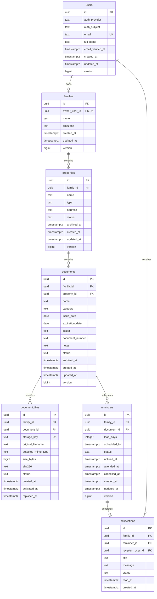

# Modelo de datos del MVP 0

## GID — Gestión Integral Doméstica

**Versión:** 0.1

**Estado:** Propuesta lista para implementación

**Documento de origen:**
[Especificación funcional del MVP 0](3.Especificacion_MVP_0.md)

---

## 1. Objetivo

Definir el modelo relacional mínimo para implementar el flujo documental del
MVP 0 sin incorporar anticipadamente los módulos posteriores del producto.

El modelo prioriza:

- Aislamiento estricto de información por familia.
- Integridad referencial comprobable en la base de datos.
- Fechas y zonas horarias sin ambigüedad.
- Archivos privados con ciclo de vida controlado.
- Recordatorios y notificaciones idempotentes.
- Archivado reversible sin pérdida accidental.
- Control de concurrencia para evitar sobrescrituras silenciosas.
- Evolución posterior sin diseñar todavía una plataforma genérica.

## 2. Alcance del modelo

### 2.1 Incluido

- Perfil de aplicación de la cuenta autenticada.
- Familia con un único propietario.
- Viviendas.
- Documentos de viviendas.
- Versiones técnicas de archivos.
- Recordatorios.
- Notificaciones internas.
- Datos mínimos de creación, modificación y archivado.

### 2.2 Excluido

- Credenciales, tokens y secretos de autenticación.
- Sesiones si son administradas por el proveedor de identidad.
- Integrantes, invitaciones, membresías y roles configurables.
- Historial general de auditoría consultable.
- Vehículos, servicios, pagos, mantenimientos y otros módulos futuros.
- Contenido binario dentro de la base de datos.
- Eliminación definitiva solicitada por el usuario desde la interfaz.

## 3. Decisiones de diseño

### 3.1 Base de datos relacional

El modelo requiere transacciones, restricciones, índices parciales y relaciones
consistentes. Se recomienda una base de datos relacional. Los nombres y tipos se
presentan de forma compatible con PostgreSQL, pero la selección definitiva se
registrará como una decisión de arquitectura.

### 3.2 Identificadores opacos

Todas las entidades utilizarán identificadores UUID generados por el sistema.
No se expondrán identificadores secuenciales que permitan inferir el volumen de
datos o enumerar registros.

El UUID no constituye una medida de autorización. Cada consulta seguirá
validando la familia correspondiente.

En operaciones de creación, el cliente obtendrá un UUID antes de enviar la
solicitud y lo reutilizará en cada reintento. Recibir de nuevo el mismo UUID, la
misma familia y el mismo contenido devolverá el resultado existente; recibir el
mismo UUID con contenido diferente producirá un conflicto. Así, un doble toque o
un reintento de red no creará dos entidades. El servidor seguirá validando el
formato del UUID y nunca lo tratará como prueba de autorización.

### 3.3 Separación entre fecha e instante

- Los días calendario se almacenan como `date`.
- Los instantes se almacenan como `timestamptz` normalizados a UTC.
- La zona horaria se almacena como identificador IANA, por ejemplo,
  `America/Monterrey`.
- Los nombres de columnas terminados en `_at` representan instantes.
- Los nombres terminados en `_date` representan fechas calendario.

### 3.4 Estados mediante texto restringido

Los estados se almacenarán como `varchar` con restricciones `CHECK`. Se evitan
tipos `ENUM` propios de la base de datos durante el MVP 0 para facilitar cambios
controlados mediante migraciones.

### 3.5 Sin borrado en cascada

Las relaciones principales utilizarán `ON DELETE RESTRICT`. El producto archiva
registros y conserva sus relaciones; una eliminación definitiva será un proceso
administrativo explícito y transaccional.

### 3.6 Defensa en profundidad para la familia

Además de filtrar cada consulta por `family_id`, las relaciones entre entidades
familiares usarán llaves foráneas compuestas. Esto impide, por ejemplo, asociar
un documento de una familia con una vivienda de otra incluso si existe un error
en el servicio de aplicación.

## 4. Diagrama de relaciones



La relación `documents` a `document_files` conserva versiones técnicas, pero
solo una puede estar activa. Para la experiencia del MVP 0 sigue existiendo un
solo archivo visible por documento.

## 5. Convenciones comunes

### 5.1 Campos de identidad

| Campo | Tipo | Regla |
| --- | --- | --- |
| `id` | `uuid` | Llave primaria, generado por el sistema |
| `family_id` | `uuid` | Frontera de autorización de la entidad |

### 5.2 Campos temporales

| Campo | Tipo | Regla |
| --- | --- | --- |
| `created_at` | `timestamptz` | Obligatorio, asignado por el servidor |
| `updated_at` | `timestamptz` | Obligatorio, cambia con cada modificación |
| `archived_at` | `timestamptz` | Obligatorio solo cuando el estado es `archived` |

Los valores temporales no se aceptarán directamente como autoridad desde el
cliente. El servidor o la base de datos asignará el instante efectivo.

### 5.3 Control de concurrencia

Las entidades editables incluirán `version bigint NOT NULL DEFAULT 1`.

Una actualización deberá incluir la versión leída por el cliente:

```sql
UPDATE documents
SET name = :name,
    version = version + 1,
    updated_at = CURRENT_TIMESTAMP
WHERE id = :id
  AND family_id = :family_id
  AND version = :expected_version;
```

Si no se actualiza ninguna fila, el servicio responderá con un conflicto y no
sobrescribirá el cambio más reciente.

### 5.4 Autoría mínima

`properties`, `documents`, `document_files` y `reminders` incluirán:

- `created_by_user_id uuid NOT NULL`.
- `updated_by_user_id uuid NOT NULL` cuando la entidad sea editable.

Durante el MVP 0 ambos usuarios deberán coincidir con el propietario de la
familia. Estos campos permitirán evolucionar hacia colaboración sin introducir
todavía membresías ni roles.

Las llaves foráneas compuestas entre `(family_id, created_by_user_id)` o
`(family_id, updated_by_user_id)` y `families (id, owner_user_id)` reforzarán esta
regla en la base de datos.

## 6. Diccionario de tablas

### 6.1 `users`

Perfil local vinculado con la identidad administrada por el mecanismo de
autenticación.

| Columna | Tipo | Nulo | Restricción |
| --- | --- | --- | --- |
| `id` | `uuid` | No | Llave primaria |
| `auth_provider` | `varchar(50)` | No | Identificador técnico del proveedor |
| `auth_subject` | `varchar(255)` | No | Identificador inmutable dentro del proveedor |
| `email` | `varchar(320)` | No | Único sin distinguir mayúsculas |
| `full_name` | `varchar(100)` | No | Longitud entre 2 y 100 |
| `email_verified_at` | `timestamptz` | Sí | Requerido para crear una familia |
| `created_at` | `timestamptz` | No | Asignado por el servidor |
| `updated_at` | `timestamptz` | No | Asignado por el servidor |
| `version` | `bigint` | No | Mayor o igual a 1 |

Reglas:

- `UNIQUE (auth_provider, auth_subject)` identifica la cuenta autenticada; el
  correo no se usa como llave foránea.
- La normalización y unicidad del correo deberán ser consistentes con el
  proveedor de identidad.
- La tabla no almacena contraseñas, tokens de verificación ni tokens de
  recuperación cuando el proveedor los administra.

### 6.2 `families`

Frontera de datos del producto.

| Columna | Tipo | Nulo | Restricción |
| --- | --- | --- | --- |
| `id` | `uuid` | No | Llave primaria |
| `owner_user_id` | `uuid` | No | FK a `users.id`; único durante el MVP 0 |
| `name` | `varchar(80)` | No | Longitud entre 2 y 80 |
| `timezone` | `varchar(64)` | No | Identificador IANA validado por la aplicación |
| `created_at` | `timestamptz` | No | Asignado por el servidor |
| `updated_at` | `timestamptz` | No | Asignado por el servidor |
| `version` | `bigint` | No | Mayor o igual a 1 |

Restricciones adicionales:

- `UNIQUE (owner_user_id)` limita una familia por cuenta en el MVP 0.
- `UNIQUE (id, owner_user_id)` permite validar receptores y autores mediante
  llaves compuestas.
- Cambiar `owner_user_id` no estará disponible en la aplicación.

### 6.3 `properties`

Viviendas pertenecientes a una familia.

| Columna | Tipo | Nulo | Restricción |
| --- | --- | --- | --- |
| `id` | `uuid` | No | Llave primaria |
| `family_id` | `uuid` | No | FK a `families.id` |
| `name` | `varchar(100)` | No | Longitud entre 2 y 100 |
| `type` | `varchar(30)` | No | `house`, `apartment`, `land`, `commercial`, `other` |
| `address` | `varchar(300)` | Sí | Sin normalización postal en el MVP 0 |
| `status` | `varchar(20)` | No | `active` o `archived` |
| `archived_at` | `timestamptz` | Sí | Consistente con `status` |
| `created_by_user_id` | `uuid` | No | Usuario que creó el registro |
| `updated_by_user_id` | `uuid` | No | Usuario de la última modificación |
| `created_at` | `timestamptz` | No | Asignado por el servidor |
| `updated_at` | `timestamptz` | No | Asignado por el servidor |
| `version` | `bigint` | No | Mayor o igual a 1 |

Restricciones adicionales:

- `UNIQUE (family_id, id)` soporta referencias compuestas.
- `CHECK` asegura que `archived_at` tenga valor solo cuando el estado sea
  `archived` y que sea nulo cuando esté `active`.
- No se requiere que el nombre sea único; una familia puede usar alias iguales.

### 6.4 `documents`

Metadatos del documento. El contenido binario se mantiene fuera de esta tabla.

| Columna | Tipo | Nulo | Restricción |
| --- | --- | --- | --- |
| `id` | `uuid` | No | Llave primaria |
| `family_id` | `uuid` | No | FK a `families.id` |
| `property_id` | `uuid` | No | Parte de FK compuesta a `properties` |
| `name` | `varchar(150)` | No | Longitud entre 2 y 150 |
| `category` | `varchar(30)` | No | Catálogo definido para el MVP 0 |
| `issue_date` | `date` | Sí | Día calendario |
| `expiration_date` | `date` | Sí | Igual o posterior a `issue_date` |
| `issuer` | `varchar(150)` | Sí | Institución emisora |
| `document_number` | `varchar(100)` | Sí | Dato sensible; no incluir en logs |
| `notes` | `varchar(2000)` | Sí | Dato sensible; no incluir en logs |
| `status` | `varchar(20)` | No | `active` o `archived` |
| `archived_at` | `timestamptz` | Sí | Consistente con `status` |
| `created_by_user_id` | `uuid` | No | Usuario que creó el registro |
| `updated_by_user_id` | `uuid` | No | Usuario de la última modificación |
| `created_at` | `timestamptz` | No | Asignado por el servidor |
| `updated_at` | `timestamptz` | No | Asignado por el servidor |
| `version` | `bigint` | No | Mayor o igual a 1 |

Restricciones adicionales:

- `FOREIGN KEY (family_id, property_id)` referencia
  `properties (family_id, id)`.
- `UNIQUE (family_id, id)` soporta referencias compuestas.
- Un `CHECK` asegura que `expiration_date >= issue_date` cuando ambas existen.
- Un `CHECK` mantiene la consistencia entre `status` y `archived_at`.
- Un documento activo solo puede crearse dentro de una vivienda activa. Esta
  regla requiere validación transaccional porque depende del estado de otra fila.

Categorías técnicas:

| Valor | Texto visible |
| --- | --- |
| `deed` | Escritura |
| `contract` | Contrato |
| `insurance_policy` | Póliza de seguro |
| `property_tax_receipt` | Recibo de predial |
| `appraisal` | Avalúo |
| `plan` | Plano |
| `warranty` | Garantía |
| `invoice` | Factura |
| `permit` | Permiso |
| `other` | Otro |

### 6.5 `document_files`

Metadatos de objetos privados asociados con documentos.

| Columna | Tipo | Nulo | Restricción |
| --- | --- | --- | --- |
| `id` | `uuid` | No | Llave primaria |
| `family_id` | `uuid` | No | FK a `families.id` |
| `document_id` | `uuid` | No | Parte de FK compuesta a `documents` |
| `storage_key` | `varchar(500)` | No | Único; ruta opaca del objeto privado |
| `original_filename` | `varchar(255)` | No | Solo para presentación |
| `detected_mime_type` | `varchar(100)` | No | PDF, JPEG o PNG detectado por contenido |
| `size_bytes` | `bigint` | No | Entre 1 y 10,485,760 bytes |
| `sha256` | `char(64)` | No | Huella hexadecimal del contenido |
| `status` | `varchar(20)` | No | `active`, `replaced` o `deleted` |
| `created_by_user_id` | `uuid` | No | Usuario que inició la carga |
| `created_at` | `timestamptz` | No | Asignado por el servidor |
| `activated_at` | `timestamptz` | No | Instante en que se vinculó el archivo validado |
| `replaced_at` | `timestamptz` | Sí | Obligatorio desde que pasa por `replaced` |
| `deleted_at` | `timestamptz` | Sí | Obligatorio cuando está `deleted` |

Restricciones adicionales:

- `FOREIGN KEY (family_id, document_id)` referencia
  `documents (family_id, id)`.
- Un índice único parcial sobre `(family_id, document_id) WHERE status = 'active'`
  garantiza un único archivo visible por documento.
- `storage_key` no contendrá correo, nombre, dirección, número de documento ni
  nombre original del archivo.
- El objeto binario no se almacena en la base de datos.
- `sha256` no será único: dos documentos pueden contener legítimamente el mismo
  archivo.
- Las cargas temporales o rechazadas no se registran como `document_files`; se
  mantienen en una zona temporal del almacenamiento hasta su validación o
  depuración.

Ruta recomendada del objeto:

```text
families/{family_id}/documents/{document_id}/files/{file_id}
```

El contenedor completo permanecerá privado. La ruta por sí sola nunca concederá
acceso.

### 6.6 `reminders`

Programación de avisos documentales.

| Columna | Tipo | Nulo | Restricción |
| --- | --- | --- | --- |
| `id` | `uuid` | No | Llave primaria |
| `family_id` | `uuid` | No | FK a `families.id` |
| `document_id` | `uuid` | No | Parte de FK compuesta a `documents` |
| `lead_days` | `smallint` | No | 0, 1, 3, 7, 15 o 30 |
| `scheduled_for` | `timestamptz` | No | Instante calculado y almacenado en UTC |
| `status` | `varchar(20)` | No | `scheduled`, `notified`, `attended`, `cancelled` |
| `notified_at` | `timestamptz` | Sí | Obligatorio desde `notified` |
| `attended_at` | `timestamptz` | Sí | Obligatorio cuando está `attended` |
| `cancelled_at` | `timestamptz` | Sí | Obligatorio cuando está `cancelled` |
| `created_by_user_id` | `uuid` | No | Usuario que creó el registro |
| `updated_by_user_id` | `uuid` | No | Usuario de la última modificación |
| `created_at` | `timestamptz` | No | Asignado por el servidor |
| `updated_at` | `timestamptz` | No | Asignado por el servidor |
| `version` | `bigint` | No | Mayor o igual a 1 |

Restricciones adicionales:

- `FOREIGN KEY (family_id, document_id)` referencia
  `documents (family_id, id)`.
- `UNIQUE (family_id, id)` soporta la referencia compuesta desde notificaciones.
- Un índice único parcial sobre `(family_id, document_id)` para estados
  `scheduled` y `notified` garantiza un único recordatorio activo.
- Los campos de transición deberán ser consistentes con el estado mediante
  restricciones `CHECK`.
- Crear un recordatorio requiere un documento activo, con vencimiento y vivienda
  activa; se validará dentro de la misma transacción.

### 6.7 `notifications`

Notificaciones internas persistentes.

| Columna | Tipo | Nulo | Restricción |
| --- | --- | --- | --- |
| `id` | `uuid` | No | Llave primaria |
| `family_id` | `uuid` | No | FK a `families.id` |
| `reminder_id` | `uuid` | No | Parte de FK compuesta a `reminders` |
| `recipient_user_id` | `uuid` | No | Propietario receptor durante el MVP 0 |
| `title` | `varchar(200)` | No | Texto visible en español |
| `message` | `varchar(500)` | No | Texto visible en español |
| `status` | `varchar(20)` | No | `unread` o `read` |
| `read_at` | `timestamptz` | Sí | Consistente con `status` |
| `created_at` | `timestamptz` | No | Instante de generación |

Restricciones adicionales:

- `FOREIGN KEY (family_id, reminder_id)` referencia
  `reminders (family_id, id)`.
- `UNIQUE (reminder_id, recipient_user_id)` constituye la llave de idempotencia.
- Una llave compuesta con `families (id, owner_user_id)` garantiza que el receptor
  sea el propietario de esa familia durante el MVP 0.
- Un `CHECK` asegura que `read_at` sea nulo para `unread` y tenga valor para
  `read`.
- El título y mensaje son una instantánea: no cambian si después se renombra el
  documento.

## 7. Relaciones e invariantes

| Invariante | Mecanismo principal |
| --- | --- |
| Una cuenta posee como máximo una familia | `UNIQUE families.owner_user_id` |
| Una vivienda pertenece a una familia | FK `properties.family_id` |
| Un documento no cruza familias | FK compuesta a `properties` |
| Un archivo no cruza familias | FK compuesta a `documents` |
| Un recordatorio no cruza familias | FK compuesta a `documents` |
| Una notificación no cruza familias | FK compuesta a `reminders` |
| Solo existe un archivo visible por documento | Índice único parcial |
| Un documento activo se publica con un archivo activo | Servicio transaccional e índice parcial |
| Solo existe un recordatorio activo por documento | Índice único parcial |
| Solo existe una notificación por recordatorio y receptor | Restricción `UNIQUE` |
| Un vencimiento no antecede a la emisión | Restricción `CHECK` |
| El archivado conserva registros relacionados | Estado y `ON DELETE RESTRICT` |
| Una edición no pisa otra silenciosamente | Columna `version` |

Las restricciones de base de datos complementan, pero no sustituyen, la
autorización y validación del servicio de aplicación.

Si la arquitectura seleccionada permite establecer de forma segura el contexto
de familia por transacción, podrá agregarse seguridad por filas (`RLS`) como una
capa adicional. Su uso no eliminará los filtros explícitos, las llaves compuestas
ni las pruebas de aislamiento.

## 8. Índices requeridos

Los siguientes índices corresponden a consultas explícitas del MVP 0:

| Tabla | Columnas o condición | Uso |
| --- | --- | --- |
| `users` | `lower(email)` único | Registro e inicio de sesión |
| `families` | `owner_user_id` único | Encontrar la familia activa |
| `properties` | `(family_id, status, updated_at DESC)` | Lista de viviendas |
| `documents` | `(family_id, property_id, status, name)` | Documentos por vivienda |
| `documents` | `(family_id, expiration_date)` para activos con vencimiento | Dashboard |
| `document_files` | `(family_id, document_id)` para `status = 'active'`, único | Archivo visible |
| `reminders` | `(status, scheduled_for)` para `status = 'scheduled'` | Trabajo programado |
| `reminders` | `(family_id, document_id)` para estados activos, único | Evitar duplicados |
| `notifications` | `(family_id, recipient_user_id, status, created_at DESC)` | Centro de notificaciones |

No se agregarán índices por cada columna. Los índices adicionales deberán
justificarse mediante una consulta real y, después de producción, por evidencia
de medición.

## 9. Operaciones transaccionales

### 9.1 Crear un documento con archivo

1. Crear una carga temporal con identificador opaco.
2. Validar tamaño, firma del contenido y tipo MIME detectado.
3. Calcular la huella SHA-256.
4. Verificar que la familia y vivienda estén activas y autorizadas.
5. Mover o copiar el objeto validado a su ubicación privada definitiva.
6. Dentro de una transacción, crear `documents` y su `document_files` activo.
7. Si falla cualquier paso, retirar tanto el objeto temporal como cualquier
   objeto definitivo sin referencia y no dejar un documento activo incompleto.

La estrategia concreta de carga directa o mediada por servidor se decidirá en
la arquitectura. Ambas deberán respetar esta atomicidad observable.

### 9.2 Sustituir un archivo

1. Cargar, validar y ubicar el objeto nuevo sin alterar el actual.
2. Bloquear el documento o verificar su `version`.
3. En una transacción, marcar el archivo actual como `replaced` y el nuevo como
   `active`.
4. Registrar `replaced_at` y la autoría correspondiente.
5. Programar la eliminación del binario reemplazado dentro de 24 horas.
6. Conservar sus metadatos y huella para auditoría técnica.

Si la activación falla, el archivo anterior continúa activo.

### 9.3 Cambiar el vencimiento

Dentro de una sola transacción:

1. Actualizar `documents.expiration_date` mediante control de versión.
2. Si existe un recordatorio `scheduled`, recalcular `scheduled_for`.
3. Si se elimina el vencimiento, cancelar el recordatorio `scheduled`.
4. Si el recordatorio ya está `notified`, no reinterpretarlo silenciosamente; el
   usuario deberá atenderlo o cancelarlo antes de crear uno nuevo.

### 9.4 Cambiar la zona horaria

Dentro de una sola transacción:

1. Validar el nuevo identificador IANA.
2. Actualizar `families.timezone` mediante control de versión.
3. Recalcular `scheduled_for` para los recordatorios `scheduled` usando el
   vencimiento de cada documento y la nueva zona horaria.
4. Generar inmediatamente los recordatorios cuya nueva fecha ya esté en el
   pasado mediante el mismo mecanismo idempotente.
5. No modificar recordatorios `notified`, `attended` o `cancelled`.

### 9.5 Archivar un documento

Dentro de una sola transacción:

1. Cambiar el documento a `archived` y asignar `archived_at`.
2. Cancelar cualquier recordatorio `scheduled` o `notified`.
3. Conservar notificaciones existentes como historial.
4. Conservar el archivo activo mientras el documento permanezca archivado.

### 9.6 Archivar una vivienda

Dentro de una sola transacción:

1. Cambiar la vivienda a `archived` y asignar `archived_at`.
2. Mantener sin cambios los estados de sus documentos y archivos.
3. Cancelar todos los recordatorios `scheduled` o `notified` de sus documentos.
4. Conservar notificaciones existentes como historial.

Restaurar la vivienda no reactiva recordatorios cancelados.

### 9.7 Generar notificaciones

Cada ejecución del trabajo programado deberá:

1. Seleccionar recordatorios `scheduled` cuyo `scheduled_for` sea menor o igual
   al instante actual.
2. Bloquear un lote pequeño de filas para permitir varios trabajadores seguros.
3. Insertar la notificación usando
   `UNIQUE (reminder_id, recipient_user_id)` como llave de idempotencia.
4. Cambiar el recordatorio a `notified` y asignar `notified_at`.
5. Confirmar ambos cambios dentro de la misma transacción.

Si el proceso se interrumpe, la transacción se revierte. Un reintento puede
ejecutarse sin crear notificaciones duplicadas.

## 10. Ciclo de vida de los archivos

```text
staged ──validar y vincular──> active ──sustituir──> replaced ──depurar──> deleted
   │
   └──rechazar o abandonar──> purged
```

- `staged`: estado exclusivo del almacenamiento temporal; todavía no existe un
  registro `document_files`.
- `active`: único archivo visible y descargable del documento.
- `replaced`: metadatos conservados; binario pendiente de depuración.
- `deleted`: el binario ya no existe; se conserva la evidencia técnica mínima.
- `purged`: resultado operativo de eliminar una carga temporal; no es un estado
  almacenado en `document_files`.

Los binarios temporales rechazados, abandonados o reemplazados se eliminarán
dentro de 24 horas. Un trabajo de reconciliación identificará objetos temporales
o definitivos sin registro para evitar archivos huérfanos.

Archivar un documento no cambia el estado `active` de su archivo. La autorización
seguirá exigiendo acceso al documento archivado.

## 11. Consultas principales

### 11.1 Dashboard

La consulta partirá de `documents` y deberá:

- Filtrar por `family_id` autorizado.
- Exigir documento y vivienda con estado `active`.
- Excluir fechas nulas.
- Comparar `expiration_date` con el día actual de la familia.
- Incluir vencidos y fechas hasta 30 días posteriores.
- Ordenar primero por clasificación y después por fecha ascendente.
- Paginar el resultado.

El “día actual” se calculará una vez por solicitud usando la zona horaria de la
familia. No se calculará individualmente para cada fila.

### 11.2 Lista de documentos por vivienda

- Filtrar por `family_id` y `property_id`.
- Mostrar un estado por consulta: activos o archivados.
- Ordenar por nombre y usar una llave estable como desempate.
- Paginar con 20 elementos inicialmente.

### 11.3 Centro de notificaciones

- Filtrar por `recipient_user_id` y familia autorizada.
- Ordenar por `created_at DESC` y `id DESC`.
- Permitir filtrar por `unread`.
- No incorporar una unión genérica con otras entidades en el MVP 0.

## 12. Protección de datos

### 12.1 Clasificación

| Nivel | Ejemplos | Tratamiento |
| --- | --- | --- |
| Restringido | Binarios, número de documento, notas | Nunca en logs; acceso autorizado y temporal |
| Personal | Correo, nombre, dirección | Minimización y acceso por familia |
| Operativo | Estados, fechas, categorías | Acceso por familia; útil para métricas agregadas |
| Técnico | UUID, versión, tamaño, MIME | Sin conceder acceso por sí mismo |

### 12.2 Logs y observabilidad

Los logs podrán contener:

- Identificadores opacos.
- Nombre de la operación.
- Código de resultado.
- Duración.
- Tamaño del archivo.
- Código técnico de rechazo.

No deberán contener:

- Contenido del archivo.
- URL temporal firmada.
- Correo completo.
- Dirección.
- Número de documento.
- Notas.
- Tokens o cookies.

### 12.3 Datos de prueba

Las semillas y pruebas usarán datos sintéticos. Los archivos de prueba deberán
ser pequeños y creados específicamente para el repositorio; no se copiarán
documentos familiares reales.

## 13. Evolución posterior al MVP 0

Las siguientes extensiones son compatibles con el modelo, pero no se crearán
todavía:

- `family_memberships` para varias cuentas y roles.
- `member_profiles` para integrantes sin cuenta.
- Más archivos activos mediante una relación con propósito y orden.
- Más recordatorios activos por documento.
- Canales de notificación y preferencias por usuario.
- `audit_events` para historial consultable.
- Un concepto documental reutilizable para vehículos e integrantes.

Antes de generalizar `documents` para varios propietarios de dominio deberá
evaluarse la integridad referencial. No se agregará una relación polimórfica
genérica basada solo en `entity_type` y `entity_id` sin una estrategia explícita
de restricciones.

## 14. Orden inicial de migraciones

1. Crear extensiones o funciones requeridas para identificadores.
2. Crear `users`.
3. Crear `families`.
4. Crear `properties`.
5. Crear `documents`.
6. Crear `document_files`.
7. Crear `reminders`.
8. Crear `notifications`.
9. Crear índices parciales y restricciones compuestas.
10. Agregar datos de catálogo únicamente si se decide representarlos como tablas.

Cada migración deberá incluir una reversión segura mientras no implique pérdida
de información. Las migraciones destructivas futuras requerirán respaldo y un
procedimiento de despliegue específico.

## 15. Validaciones del modelo

Antes de considerarlo implementado deberán existir pruebas que demuestren:

- Rechazo de relaciones cruzadas entre familias.
- Rechazo de dos familias para un propietario durante el MVP 0.
- Rechazo de fechas de vencimiento anteriores a la emisión.
- Rechazo de dos archivos activos para un documento.
- Rechazo de dos recordatorios activos para un documento.
- Rechazo de dos notificaciones para el mismo recordatorio y receptor.
- Detección de una actualización con versión obsoleta.
- Consistencia entre estados y campos temporales.
- Cancelación de recordatorios al archivar documentos o viviendas.
- Preservación de documentos y archivos al archivar una vivienda.
- Eliminación de objetos rechazados o reemplazados.
- Consultas del dashboard limitadas a la familia autorizada.

## 16. Decisiones pendientes de arquitectura

Este modelo no requiere respuesta del usuario para continuar, pero la
implementación deberá resolver mediante registros de decisión:

- Proveedor de identidad o autenticación propia.
- Motor y servicio administrado de base de datos.
- Proveedor de almacenamiento privado.
- Estrategia de carga y validación de archivos.
- Ejecutor de tareas programadas.
- Política final de respaldo y restauración.
- Ubicación geográfica y ambientes de despliegue.

Estas decisiones se tomarán después de cerrar la matriz de permisos y los flujos
de interfaz, para elegir tecnología a partir de necesidades concretas.
