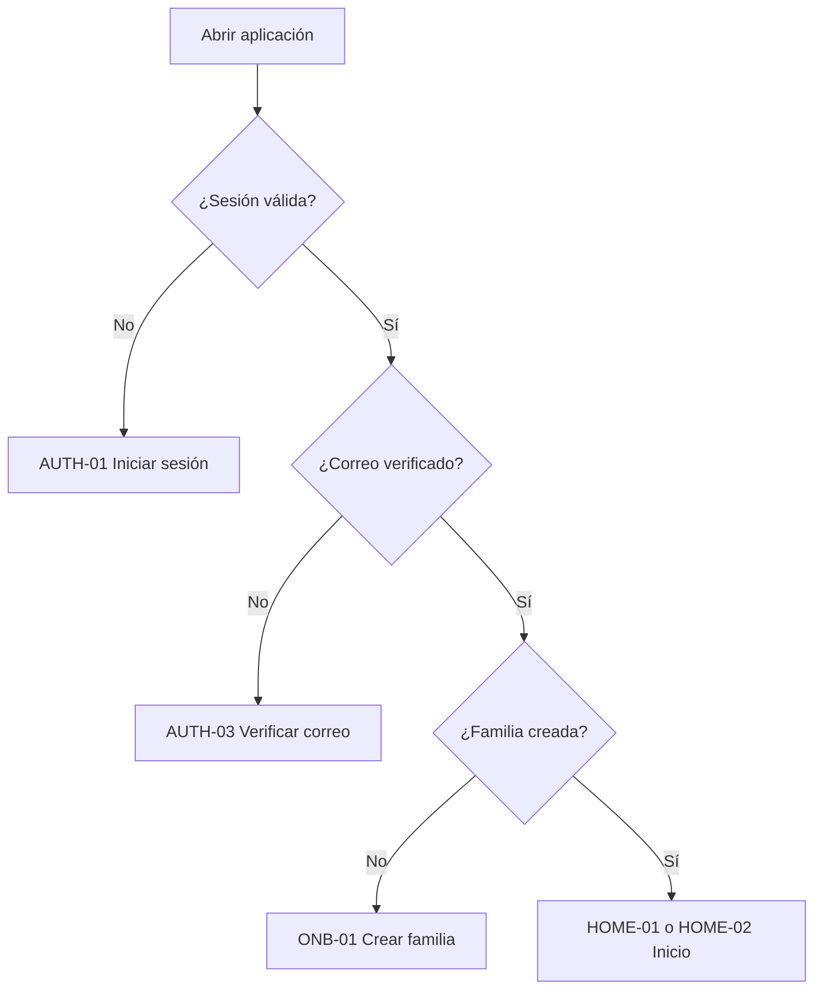
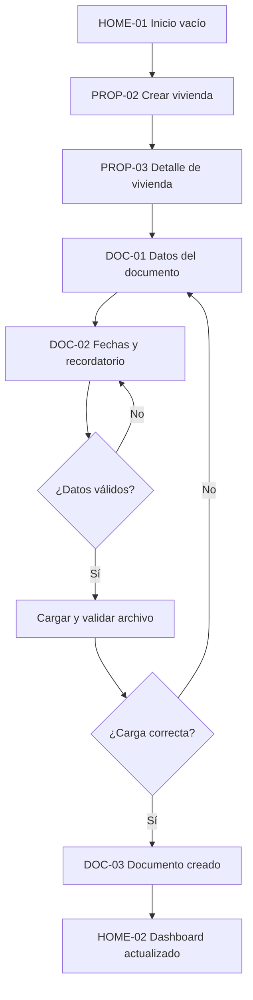
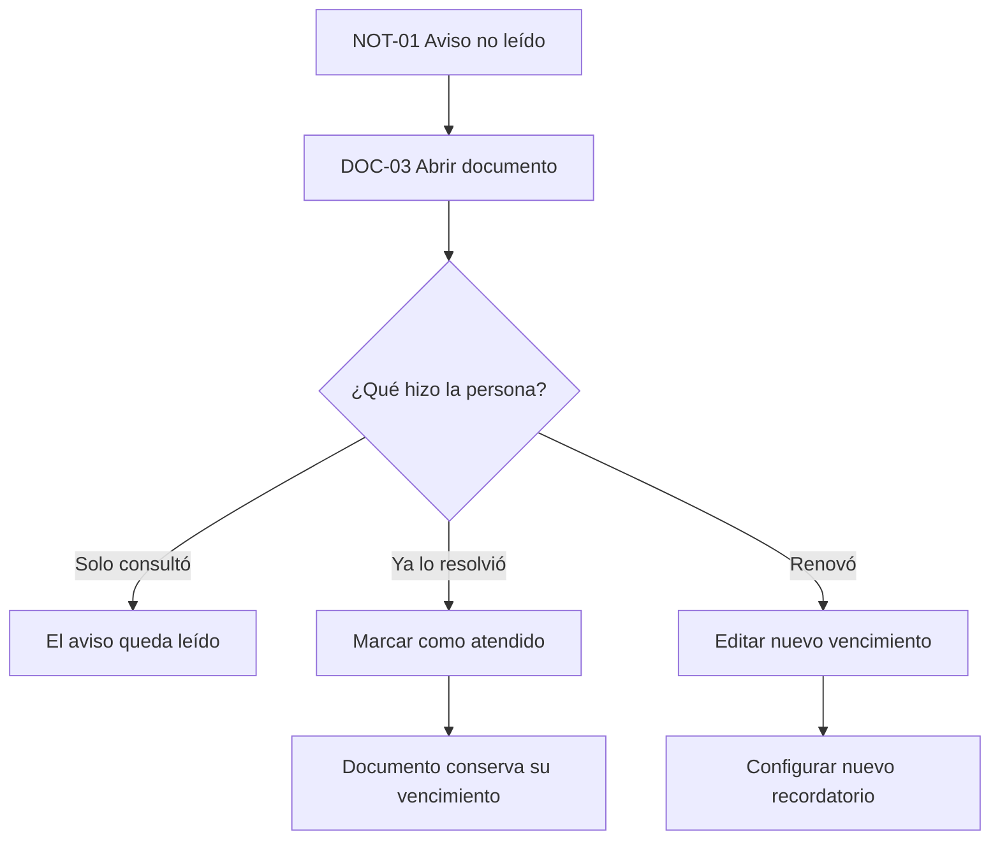

# Flujos UX del MVP 0

## GID — Gestión Integral Doméstica

**Versión:** 0.1

**Estado:** Propuesta para prototipo en Figma

**Documentos relacionados:**

- [Especificación funcional del MVP 0](3.Especificacion_MVP_0.md)
- [Modelo de datos del MVP 0](4.Modelo_datos_MVP_0.md)
- [Matriz de permisos del MVP 0](5.Matriz_permisos_MVP_0.md)
- [Guía de diseño UI del MVP 0](7.Guia_diseno_UI_MVP_0.md)

---

## 1. Objetivo de experiencia

La interfaz debe ayudar a una persona a guardar su primer documento y configurar
un recordatorio en menos de cinco minutos, sin necesitar conocer la estructura
interna del producto.

La experiencia debe transmitir:

- Confianza para almacenar información importante.
- Claridad sobre qué requiere atención.
- Calma, evitando una apariencia de alarma permanente.
- Control sobre archivos, vencimientos y archivado.
- Continuidad entre teléfono y escritorio.

## 2. Principios de flujo

1. Mostrar primero la siguiente acción útil.
2. Solicitar solo la información necesaria en cada momento.
3. Mantener el contexto: vivienda, documento y vencimiento siempre visibles.
4. Distinguir “leer”, “atender” y “renovar”; no son la misma acción.
5. Confirmar acciones con consecuencias, no cada interacción cotidiana.
6. Conservar datos capturados ante errores recuperables.
7. Explicar estados vacíos y errores con una acción concreta.
8. No depender únicamente del color para comunicar urgencia.

## 3. Arquitectura de información

```text
Acceso
├── Crear cuenta
├── Verificar correo
├── Iniciar sesión
└── Recuperar contraseña

Configuración inicial
└── Crear familia

Aplicación
├── Inicio
│   ├── Resumen de atención
│   ├── Vencidos
│   ├── Vencen hoy
│   └── Próximos 30 días
├── Viviendas
│   ├── Lista activa
│   ├── Detalle de vivienda
│   │   ├── Documentos activos
│   │   └── Crear documento
│   └── Archivo
│       ├── Viviendas archivadas
│       └── Documentos archivados
├── Avisos
│   ├── No leídos
│   └── Todos
└── Cuenta
    ├── Perfil
    ├── Familia y zona horaria
    └── Cerrar sesión
```

## 4. Navegación

### 4.1 Teléfono

Barra inferior con tres destinos:

| Destino | Etiqueta | Contenido |
| --- | --- | --- |
| Inicio | `Inicio` | Dashboard y próximos vencimientos |
| Viviendas | `Viviendas` | Viviendas y documentos |
| Avisos | `Avisos` | Notificaciones internas |

La cuenta se abre desde el avatar en la barra superior. El botón principal de
creación aparece dentro del contexto correspondiente:

- `Agregar vivienda` en Viviendas.
- `Agregar documento` dentro de una vivienda.

No se recomienda un botón global que muestre acciones todavía inexistentes en el
MVP 0.

La vista `Archivo` se abre desde una acción secundaria claramente etiquetada en
Viviendas; no debe depender de un gesto oculto.

### 4.2 Escritorio

La barra inferior se transforma en navegación lateral fija. El área central usa
un ancho máximo legible y puede mostrar una columna secundaria de contexto.

### 4.3 Comportamiento de regreso

- Regresar desde un detalle vuelve a la lista y conserva posición y filtros.
- Regresar durante un formulario con cambios abre una confirmación para descartar.
- Cerrar un modal devuelve el foco al control que lo abrió.
- Abrir un documento desde un aviso conserva el aviso como leído, pero no atiende
  automáticamente el recordatorio.

## 5. Inventario de pantallas

| ID | Pantalla | Propósito |
| --- | --- | --- |
| `AUTH-01` | Iniciar sesión | Acceder a una cuenta existente |
| `AUTH-02` | Crear cuenta | Registrar nombre, correo y contraseña |
| `AUTH-03` | Verificar correo | Confirmar correo o reenviar mensaje |
| `AUTH-04` | Recuperar contraseña | Solicitar y establecer nueva contraseña |
| `ONB-01` | Crear familia | Definir nombre y zona horaria |
| `HOME-01` | Inicio vacío | Orientar el primer registro |
| `HOME-02` | Inicio con datos | Priorizar vencimientos |
| `PROP-01` | Viviendas | Listar viviendas activas |
| `PROP-02` | Crear o editar vivienda | Capturar datos de vivienda |
| `PROP-03` | Detalle de vivienda | Consultar y agregar documentos |
| `DOC-01` | Datos del documento | Capturar archivo y datos esenciales |
| `DOC-02` | Fechas y recordatorio | Definir vencimiento y anticipación |
| `DOC-03` | Detalle de documento | Consultar archivo, metadatos y estado |
| `DOC-04` | Sustituir archivo | Validar y reemplazar contenido |
| `NOT-01` | Avisos | Consultar notificaciones |
| `ARC-01` | Archivo | Consultar viviendas y documentos archivados |
| `ACC-01` | Cuenta | Perfil, familia, zona horaria y sesión |

## 6. Enrutamiento inicial



## 7. Flujo principal



### 7.1 Crear cuenta

1. La persona abre `Crear cuenta`.
2. Captura nombre, correo y contraseña.
3. Acepta continuar y ve una confirmación neutra.
4. Abre el enlace recibido.
5. La pantalla de verificación confirma el resultado.
6. Continúa a crear su familia.

Estados alternos:

- Correo posiblemente registrado: usar una respuesta neutra y ofrecer iniciar
  sesión o recuperar contraseña sin confirmar si la cuenta existe.
- Token vencido: explicar y ofrecer `Reenviar verificación`.
- Sin conexión: conservar nombre y correo; no conservar la contraseña en texto
  persistente.

### 7.2 Crear familia

1. Mostrar una explicación breve: “Tu familia es el espacio privado donde se
   guardarán tus viviendas y documentos”.
2. Solicitar nombre de la familia.
3. Sugerir la zona horaria detectada.
4. Permitir buscar o seleccionar otra zona.
5. Crear y dirigir al inicio vacío.

No se muestran roles, invitaciones, moneda ni preferencias todavía.

### 7.3 Crear la primera vivienda

1. El inicio vacío presenta una sola acción primaria: `Agregar vivienda`.
2. Solicitar nombre o alias y tipo.
3. Mantener dirección dentro de `Más detalles` como campo opcional.
4. Guardar y abrir el detalle de la vivienda.
5. Mostrar estado vacío de documentos con `Agregar documento`.

### 7.4 Crear un documento

Se recomienda un formulario de dos pasos para reducir carga visual sin convertir
el proceso en un asistente largo.

#### Paso 1: documento y archivo

- Vivienda actual, visible y no editable desde el formulario.
- Nombre.
- Categoría.
- Zona para elegir archivo PDF, JPEG o PNG.
- Resumen de formato y límite de 10 MiB.
- `Más detalles`: institución, número y notas.

La acción principal es `Continuar`. No se crea todavía un documento activo.

#### Paso 2: fechas y recordatorio

- Fecha de emisión opcional.
- Fecha de vencimiento opcional.
- Interruptor `Recordarme antes de vencer`, habilitado solo si hay vencimiento.
- Anticipación: 0, 1, 3, 7, 15 o 30 días.
- Resumen calculado: “Te avisaremos el 14 de agosto de 2026 a las 9:00 a. m.”.

Al capturar un vencimiento se propone el recordatorio activado con 15 días de
anticipación. La selección debe ser visible y fácil de desactivar; no se guarda
sin que la persona confirme el formulario.

La acción principal es `Guardar documento`.

#### Durante la carga

- Bloquear nuevos envíos, pero permitir cancelar mientras sea seguro.
- Mostrar nombre, tamaño y progreso.
- Usar el texto `Validando archivo…` después de transferirlo.
- Al completar, abrir el detalle con confirmación no bloqueante.

#### Si falla

- Mantener los campos y fechas.
- Explicar si fue tamaño, formato, conexión o error temporal.
- Ofrecer `Elegir otro archivo` o `Reintentar` según corresponda.
- No mostrar un documento incompleto en la vivienda.

## 8. Inicio y prioridad

### 8.1 Inicio vacío

Debe explicar el valor, no parecer un error:

**Título:** `Todo empieza con una vivienda`

**Descripción:** `Agrega una vivienda para guardar su primer documento y recibir
avisos antes de que venza.`

**Acción:** `Agregar vivienda`

### 8.2 Inicio con datos

Orden recomendado:

1. Encabezado con saludo breve y acceso a cuenta.
2. Resumen de atención con conteos: vencidos, hoy y próximos.
3. Sección `Necesita atención` para vencidos y hoy.
4. Sección `Próximos 30 días`.
5. Enlace a viviendas.

Cada tarjeta de documento muestra:

- Estado textual e icono.
- Nombre del documento.
- Vivienda.
- Fecha absoluta; por ejemplo, `18 ago 2026`.
- Contexto relativo; por ejemplo, `en 18 días`.
- Acción para abrir el detalle.

No se recomienda mostrar gráficas en el MVP 0. Los pocos datos disponibles se
comprenden mejor mediante listas priorizadas.

## 9. Detalle de documento

Orden del contenido:

1. Nombre, categoría y estado.
2. Mensaje de vencimiento o `Sin vencimiento`.
3. Vista previa del archivo.
4. Acciones `Ver archivo` y `Descargar`.
5. Recordatorio y fecha calculada.
6. Metadatos adicionales.
7. Acciones secundarias: editar, sustituir archivo y archivar.

### 9.1 Atender un aviso



`Marcar como atendido` requiere confirmación breve que explique que no cambia la
fecha del documento. Después se ofrece `Actualizar vencimiento` como siguiente
acción, sin obligarla.

## 10. Archivado y restauración

### 10.1 Archivar documento

La confirmación debe indicar:

- Desaparecerá de las vistas activas.
- Se cancelará su recordatorio pendiente.
- El archivo se conservará.

Acciones: `Cancelar` y `Archivar documento`.

### 10.2 Archivar vivienda

La confirmación debe indicar:

- La vivienda y sus documentos dejarán de mostrarse en vistas activas.
- Se cancelarán los recordatorios pendientes de esos documentos.
- Los documentos y archivos se conservarán.

La acción destructiva exige el nombre explícito `Archivar vivienda`; no usar solo
`Aceptar`.

### 10.3 Restaurar

Restaurar no reactiva recordatorios. Después de restaurar se muestra un aviso:

`La vivienda volvió a estar activa. Revisa los documentos que necesiten un nuevo
recordatorio.`

## 11. Estados transversales

| Estado | Presentación | Acción principal |
| --- | --- | --- |
| Cargando | Esqueleto con estructura estable | Ninguna |
| Vacío inicial | Explicación y una ilustración discreta | Crear primer recurso |
| Vacío por filtro | Mensaje corto | Limpiar filtro |
| Sin conexión | Banner y pantalla actual sin prometer datos actualizados | Reintentar |
| Error temporal | Mensaje contextual | Reintentar |
| Sin autorización | Pantalla neutra sin revelar datos | Volver al inicio |
| Conflicto de versión | Explicar que existe información más reciente | Recargar cambios |
| Archivo inválido | Motivo específico | Elegir otro archivo |
| Guardado correcto | Mensaje no bloqueante | Continuar |

Los esqueletos deben aproximar el contenido real para evitar saltos de layout.
No usar un spinner a pantalla completa para cargas de listas.

## 12. Formularios

- Etiquetas visibles sobre los campos; el placeholder no sustituye la etiqueta.
- Marcar campos opcionales con `Opcional`, evitando llenar la pantalla de
  asteriscos.
- Validar al salir del campo y al enviar, no en cada pulsación inicial.
- Colocar el error debajo del campo y llevar el foco al primer error al enviar.
- En móvil, mantener la acción principal visible sin cubrir el contenido.
- Deshabilitar la acción solo cuando exista una razón clara y explicar campos
  faltantes mediante validación.
- Usar selectores nativos o accesibles para fechas.
- Mostrar siempre la zona horaria junto a la hora calculada del recordatorio.

## 13. Contenido y tono

La voz debe ser clara, tranquila y directa.

| Evitar | Preferir |
| --- | --- |
| `Operación exitosa` | `Documento guardado` |
| `Error 422` | `Revisa la fecha de vencimiento` |
| `Recurso no encontrado` | `No encontramos este documento` |
| `¿Está seguro?` | Explicar qué ocurrirá y qué se conservará |
| `Submit` | `Guardar documento` |
| `Delete` | `Archivar` cuando esa sea la operación real |

No usar lenguaje financiero ni legal si no es necesario.

## 14. Prototipo sugerido en Figma

Crear dos recorridos conectados:

### 14.1 Recorrido de primera vez

`AUTH-02 → AUTH-03 → ONB-01 → HOME-01 → PROP-02 → PROP-03 → DOC-01 → DOC-02 → DOC-03 → HOME-02`

### 14.2 Recorrido de atención

`HOME-02 → NOT-01 → DOC-03 → Marcar atendido → Editar vencimiento → DOC-03`

### 14.3 Escenario de error

`DOC-01 → Archivo demasiado grande → Elegir otro archivo → DOC-02 → Error de red → Reintentar → DOC-03`

Para las pruebas, el prototipo deberá permitir completar cada recorrido sin
explicaciones externas.

## 15. Criterios de validación UX

- La persona identifica la acción principal de cada pantalla en menos de cinco
  segundos.
- Puede registrar vivienda, documento y recordatorio en menos de cinco minutos.
- Comprende que leer un aviso no equivale a atenderlo.
- Comprende que atender no renueva la fecha del documento.
- Comprende qué se conserva al archivar.
- Puede recuperar un error de archivo sin volver a capturar todo.
- Puede navegar con teclado y lector de pantalla en los flujos principales.
- Ningún flujo depende exclusivamente de gestos ocultos.
